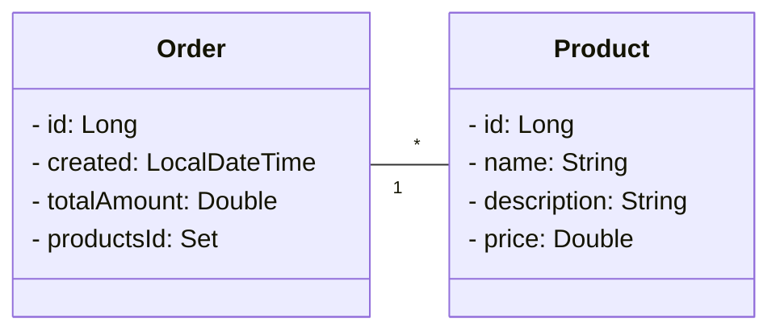

# Backend

## Descrição

Backend para o gerenciamento de pedidos, desenvolvido com **arquitetura de microserviços**.
Atualmente, a comunicação entre os serviços é feita por meio do **OpenFeign**, mas o projeto continuará evoluindo para incorporar outros conceitos e práticas de backend, como **testes automatizados**, **segurança** e **boas práticas de arquitetura**.

---

## Tecnologias

* **Java 17**
* **Spring Boot**
* **Spring Data JPA**
* **Spring Security**
* **PostgreSQL**
* **Flyway** (migração de banco de dados)
* **OpenFeign** (comunicação entre microserviços)
* **Eureka Client** (descoberta de serviços)
* **Docker**
* **Mockito** (testes unitários)

---

## Diagrama de Classes

---

## Integração dos Serviços

* **Product Service** → Gerenciamento de produtos
* **Order Service** → Gerenciamento de pedidos e integração com o Product Service
* **Eureka** → Descoberta de serviços
* **OpenFeign** → Comunicação declarativa entre microserviços
* **API Gateway** → Ponto único de entrada para requisições

---