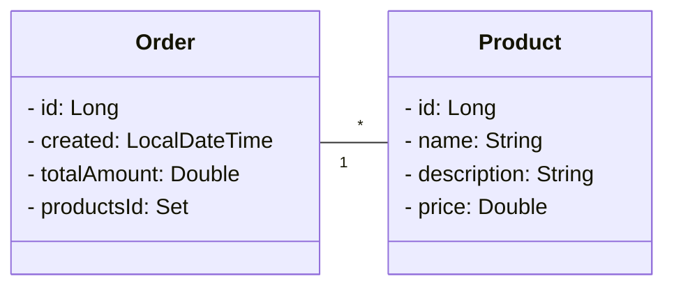

# Backend

## Descrição

---

## Tecnologias
- Java 17  
- Spring Boot  
- Spring Data JPA  
- PostgreSQL  
- OpenFeign  
- Eureka Client
- Docker 

---

## Diagrama de Classes

---

## Integração

Eureka → Descoberta de serviços

OpenFeign → Comunicação com Product Service

API Gateway → Entrada única para requisições